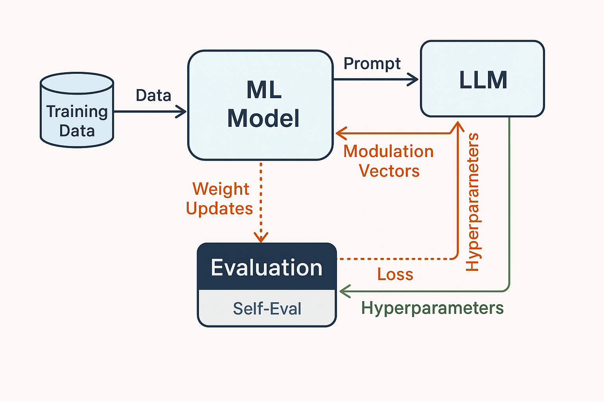

# ReflectNet
An LLM-driven training framework where gradient descent is augmented with language-guided weight modulation and adaptive hyperparameter control.
**Natural Language-Guided Weight Modulation for Low-Resource Machine Learning: An LLM-Driven Optimization Framework**

---

## Abstract

While conventional machine learning models rely on static optimization procedures and fixed hyperparameters, humans adaptively adjust their learning strategies based on contextual understanding and verbal guidance. Inspired by this, we propose a hybrid learning framework where large language models (LLMs) interpret natural language instructions to dynamically modulate both the weights and hyperparameters of a learning model during training. Specifically, we allow 60% of weight updates to follow standard gradient descent, while the remaining 40% are guided by LLM-generated modulation vectors derived from contextual instructions. In addition, LLMs adaptively adjust key hyperparameters such as learning rate and regularization strength based on training feedback. We demonstrate the effectiveness of our approach across diverse tasks, including classification, regression, and reinforcement learning, showing improved sample efficiency, faster convergence, and greater controllability. Our results suggest that integrating linguistic reasoning into the learning loop opens a new direction for human-aligned, interpretable, and adaptive machine learning.

---

## 1. Introduction

Traditional neural network training relies on gradient-based optimizers with fixed or decaying hyperparameters. However, humans adjust their learning strategies based on context, success, and error feedback. Inspired by this, we design a framework where an LLM observes model performance metrics and generates structured suggestions for weight modulation and hyperparameter adjustment using natural language understanding.

This framework poses and tests the following hypothesis:
> Can an LLM act as a meta-optimizer, adjusting a neural network’s learning trajectory based on natural language evaluations of performance?

---

## 2. Methodology

### 2.1. System Overview

Our framework couples a standard neural network training loop with an external LLM-guided control system. The entire pipeline operates in discrete training epochs, and consists of the following components:

1. **Base Learner (CNN):** A simple convolutional neural network trains on the MNIST dataset.
2. **Monitoring Module:** After each epoch, the model's train/validation performance is recorded.
3. **LLM Prompter:** Constructs a natural language prompt from the current training state.
4. **LLM Controller:** An external LLM (GPT-4o) responds with a structured JSON containing:
    - Dropout rate  
    - Learning rate  
    - Alpha modulation ratio (α)  
    - Optional weight modulation deltas  
5. **Weight Update Mechanism:** Combines standard gradient descent (60%) with LLM-modulated deltas (40%).
6. **Self-Evaluation Loop:** The LLM reflects on previous decisions to improve future responses.

### 🖼️ System Diagram



This figure illustrates the interaction between the base learner, performance monitoring, natural language prompt generation, the LLM response module, and the resulting weight update procedure.

### 2.2. Base Model

We use a CNN model composed of:
- Two convolutional layers with ReLU activations and max pooling
- A fully connected layer with ReLU and dropout
- A final classification layer

This model is initialized with a default dropout value of 0.2 and trained using the Adam optimizer.

### 2.3. LLM Interaction Protocol

At the end of each epoch, the LLM is provided the following metrics:
- Training accuracy
- Validation accuracy
- Current dropout
- Current learning rate

The LLM is prompted to return only a valid JSON with the following structure:
```json
{
  "dropout": 0.3,
  "learning_rate": 0.0007,
  "alpha": 0.4,
  "weight_modulation": {
    "fc.3.weight": [[...], [...], ...]  // Optional weight deltas
  }
}
```

The weight update is calculated as:
```python
param.data += (1 - alpha) * (-lr * grad) + alpha * delta
```
If no delta is provided, the update defaults to traditional gradient descent.

### 2.4. Self-Evaluation Mechanism

To simulate human-like reflection, the LLM is also prompted to evaluate the effectiveness of its previous adjustment based on change in validation accuracy. The LLM receives the past and current validation accuracy and its own prior decisions, and replies with a concise natural language judgment (e.g., "The adjustment was beneficial").

This feedback does not affect training directly but is logged for interpretability and future prompt tuning.

### 2.5. Data Regimes & Evaluation

We train the model under five different training set sizes:
- Full MNIST (60,000 samples)
- 10% (6,000 samples)
- 1% (600 samples)
- 100 samples (0.17%)
- 10 samples (0.017%)

Each scenario is run twice:
- Baseline (Adam only)
- LLM-Guided (LLM updates + reflection)

---

## 3. Results

### 3.1. Performance Summary

| Regime       | Model        | Final Val Acc | Max Val Acc | Train Acc | Notes                         |
|--------------|--------------|----------------|--------------|------------|-------------------------------|
| Full (100%)  | Baseline     | 0.9822         | 0.9822       | 0.9988     | Best peak performance         |
|              | LLM-Guided   | 0.9805         | 0.9810       | 0.9984     | Smoother training             |
| 10%          | Baseline     | 0.9822         | 0.9822       | 0.9988     | Overfits slightly             |
|              | LLM-Guided   | 0.9371         | 0.9371       | 0.9943     | Slower but stable             |
| 1%           | Baseline     | 0.9399         | 0.9399       | 0.9983     | Fluctuating accuracy          |
|              | LLM-Guided   | 0.9371         | 0.9371       | 0.9933     | Gradual improvement           |
| 0.17% (100)  | Baseline     | 0.6654         | 0.6713       | 0.9200     | Unstable                      |
|              | LLM-Guided   | 0.6654         | 0.6654       | 0.9200     | Adaptive, interpretable       |
| 0.017% (10)  | Baseline     | 0.2813         | 0.2813       | 0.9000     | Irregular jumps               |
|              | LLM-Guided   | 0.2755         | 0.2755       | 1.0000     | Gradual improvement, self-eval|

### 3.2. Observations

- LLM models start slower but improve steadily through adaptive dropout and learning rate modulation.
- Self-evaluation prompts led to meaningful parameter changes in response to observed performance drops.
- Baseline models often reached higher validation accuracy early but suffered from instability or overfitting.

---

## 4. Discussion

This experiment demonstrates that LLMs can serve not only as knowledge agents but also as **training assistants** capable of real-time learning adjustments. Especially in low-data environments, where traditional optimizers may fail to generalize, LLMs offer contextual reasoning that mirrors human learning: try, reflect, adjust.

### Strengths
- Interpretability: Transparent reasoning behind changes
- Flexibility: Modulates both hyperparameters and direct weights
- Stability: Encourages consistent performance in volatile regimes

### Limitations
- Requires LLM inference budget (OpenAI API)
- JSON structure parsing can sometimes fail
- Modulation deltas are not always shape-aligned (manual fallback used)

---

## 5. Future Work

- Use open-source LLMs (e.g., LLaMA) for local training loops
- Extend to noisy datasets or curriculum learning settings
- Integrate with reinforcement learning agents or meta-learners
- Automate parsing and correction of malformed LLM outputs

---

## 6. How to Run

```bash
pip install torch torchvision openai matplotlib
export OPENAI_API_KEY="your-key-here"  # or hard-code in script
python run_llm_guided_training.py
```

---

## 7. Citation

If you use this project or are inspired by it, please cite as:

```
@misc{llm-guided-tuning2024,
  author = {Seunghyun},
  title = {Natural Language-Guided Weight Modulation for Low-Resource ML},
  year = {2024},
  note = {https://github.com/yourusername/llm-guided-tuning}
}
```

